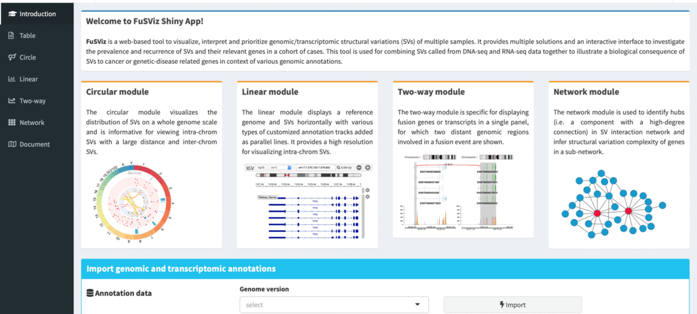

### Overview

A web app to visualise, interpret and prioritise genomic/transcriptomic structural variations (SVs) of multiple samples. It provides multiple solutions and an interactive user interface to investigate the prevalence and recurrence of SVs and their relevant genes in a cohort of cases. The tool is designed for combining SVs called from DNA-seq (e.g. whole genome or target exome) and RNA-seq to illustrate a biological implication of SVs to the host genes and interested genomic regions in context of various annotations, and it can also integrate a mutation profile (SNVs/Indels) to reveal a connection between small variants and complex genomic aberrations. 

 

### Getting a quick start

#### Installation & launch

    if (! require('devtools')) install.packages('devtools')
    devtools::install_github(‘senzhao_code/FuSViz’)
    
    source(file.path(system.file("app", package = "FuSViz"), "global.R"), local = TRUE, chdir = TRUE)
    FuSViz_app()

#### Usage & manual

A full description of FuSViz documentation is available: &nbsp;&nbsp; 

### Contact

t.cytotoxic AT gmail.com

 
